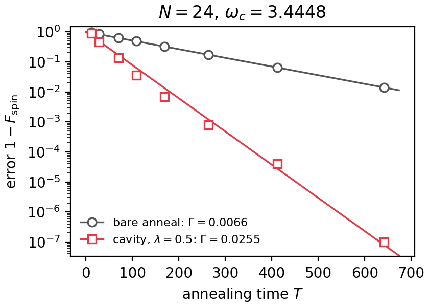

# Cavity quantum annealing

[](https://arxiv.org/abs/2609.33975)

Minimal code for H. Zhang, *Swapping Quantum Annealing Errors into a Cavity*,
[arXiv:2609.33975](https://arxiv.org/abs/2609.33975) (2026). It simulates a quantum annealer (the
ferromagnetic p-spin model) coupled to one cavity mode and reproduces the paper's reference point.

## Model

$$
H(s) = (1-s)H_D + sH_P + \omega_c a^\dagger a + g(s)(a+a^\dagger)O + \frac{g(s)^2}{\omega_c}O^2, \qquad s=t/T,
$$

with $H_D=-2S_x$, $H_P=-N(2S_z/N)^3$, $O=2S_x/\sqrt N$, $g(s)=g_0\sin^2(\pi s)$ and
$g_0=\lambda\omega_c/\sqrt N$. The register is kept in the symmetric subspace $S=N/2$ and the
cavity is truncated at `n_max` photons. Setting $\lambda=0$ gives the bare anneal. The figure of
merit is $F_{\rm spin}$, the probability that the register ends in the ground state of $H_P$.

The time evolution uses the fourth-order commutator-free Magnus integrator: each step is a product
of two exact matrix exponentials, so the evolution is unitary to machine precision and the error
falls as the fourth power of the step.

## Usage

```bash
pip install -r requirements.txt
python example_N24.py      # about two minutes; writes error_vs_T.png
python test_reference.py   # compares with the paper's data
```

`example_N24.py` runs the bare and cavity anneals for $N=24$, $\omega_c=3.4448$, $\lambda=0.5$,
plots the error $1-F_{\rm spin}$ against the annealing time $T$ and fits each curve with $e^{-\Gamma T}$
(the annealing times and fitted rates of Fig. 2(c) in the paper):



`test_reference.py` checks four annealing times against the data behind Fig. 2(c) of the paper, computed
with an independent code (adaptive Runge-Kutta, rtol $10^{-12}$, `n_max = 12`); the largest relative
deviation is below $10^{-4}$.

## Files

| file                  | content                                              |
| --------------------- | ---------------------------------------------------- |
| `cqa.py`            | model (`CavityAnneal`) and integrator (`evolve`) |
| `example_N24.py`    | reference-point example and figure                   |
| `test_reference.py` | check against the paper's data                       |

## Citation

```bibtex
@misc{Zhang2026SwappingQA,
  title         = {Swapping Quantum Annealing Errors into a Cavity},
  author        = {Zhang, Hao},
  year          = {2026},
  eprint        = {2609.33975},
  archivePrefix = {arXiv},
  primaryClass  = {quant-ph},
  url           = {https://arxiv.org/abs/2609.33975}
}
```

## License

MIT
